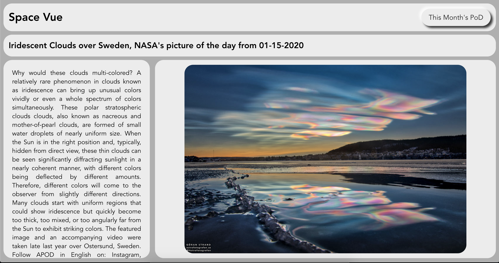
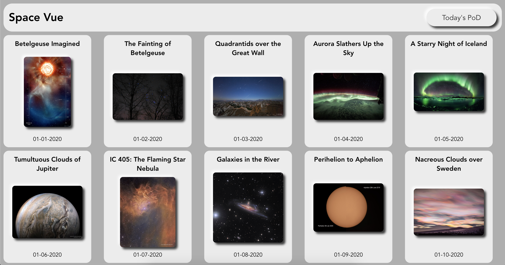

[//]: # (use this line to add comments)
# Space-Vue

#### Live Application - [Deployed to Heroku](https://space-vue.herokuapp.com/)

### Summary
Space-Vue is a single-page application built in Vue.js that queries the NASA Astronomy Picture of the Day API and displays today's and this month's Pictures of the Day with descritpions.

### Technologies Utilized
- Vue
- Node JS
- Express
- Heroku

## To run the program locally  
### Clone and Install UI

Clone down the repository.

Install the application's dependencies from within the cloned directory:
```bash
npm install
```
Then launch the application within the browser:
```bash
npm start
```

## Developer  
Kirk Veitch - [github account](https://github.com/KVeitch)

## Screenshots  



## Initial Wireframes  


